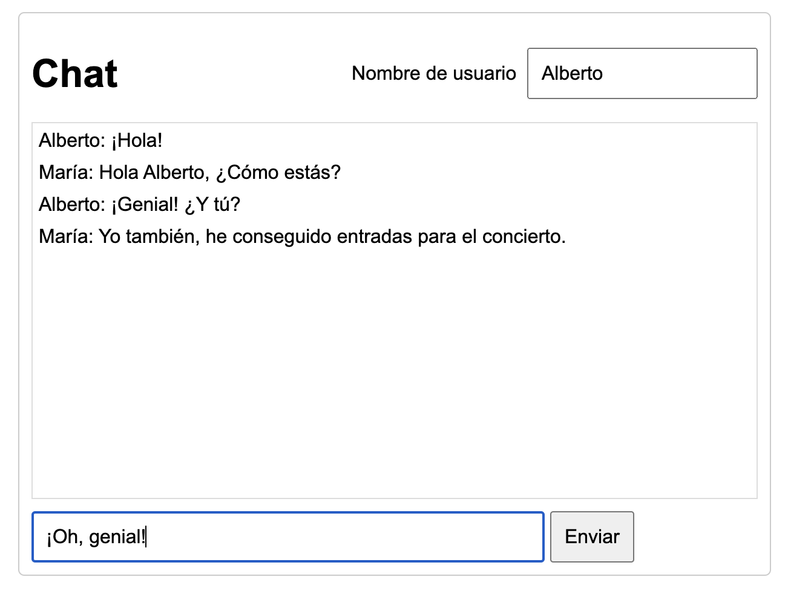

# Go Chat

Ejemplo básico de uso de websockets en Go con gorilla/websocket aplicado a una aplicación de chat en tiempo real.

El servidor levanta una interfaz web de chat en el puerto 8080 a la que podemos acceder desde `http://localhost:8080`. Adicionalmente, el servidor expone un endpoint en `/ws` donde se gestiona la comunicación de los websockets.

